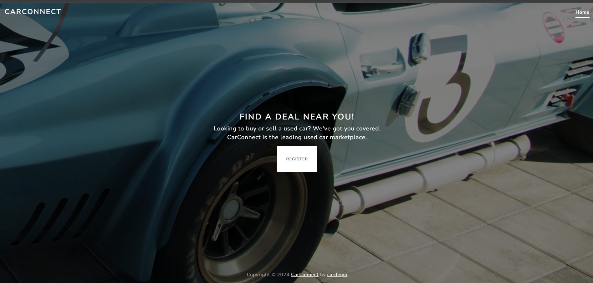
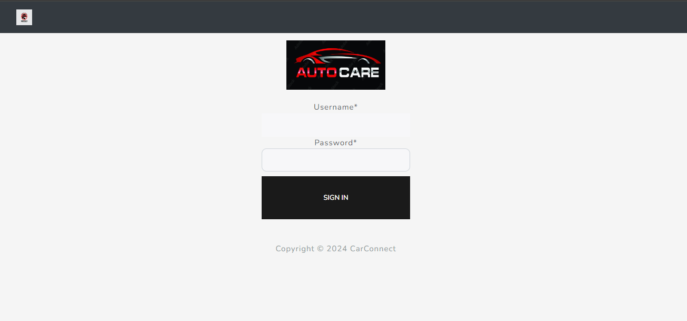
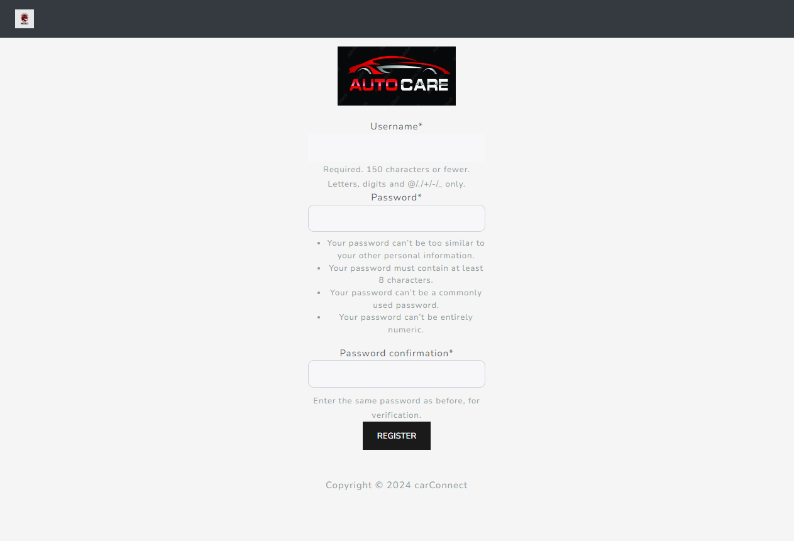
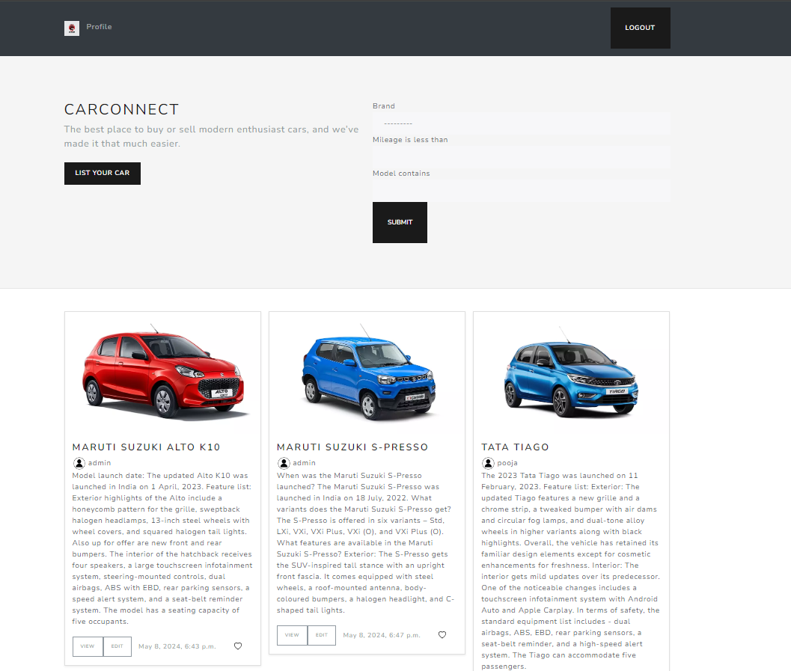
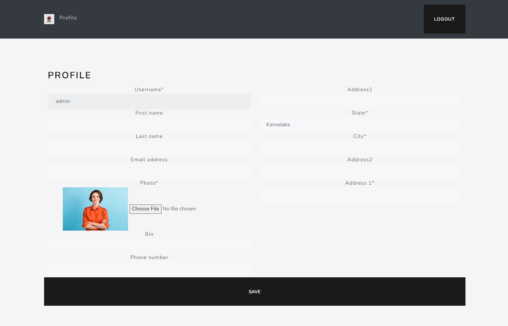
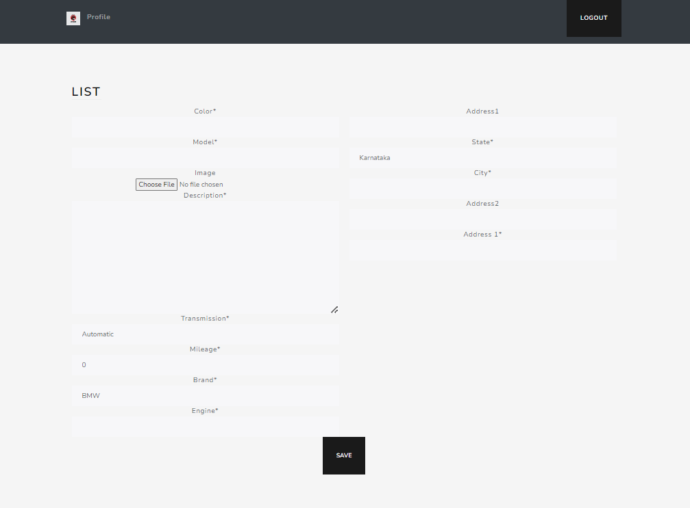

# CarConnect Django Project

## Description
CarConnect is a Django project designed to facilitate car listing and connecting buyers with sellers. It includes features such as user authentication, car listing with filters, user profiles, and more.

## Screenshots
Include some screenshots here to give a visual overview of the project. 

### Home Page


### Login Page


### Signup Page


### Car Listing Page


### User Profile Page


### Car Listing Form


## Installation
1. Clone the repository:
    ```
    git clone https://github.com/Datirsayali12/carSearcher.git
    ```
2. Install dependencies:
    ```
    pip install -r requirements.txt
    ```
3. Run migrations:
    ```
    python manage.py migrate
    ```
4. Start the development server:
    ```
    python manage.py runserver
    ```

## Usage
1. Access the application in your web browser at `http://localhost:8000`.
2. Navigate through the different pages:
    - Home page: Provides an overview of the application.
    - Login/Signup: Authenticate yourself or create a new account.
    - Car Listing: View all cars listed with applied filters.
    - User Profile: View and edit your profile information.
    - Car Listing Form: Add a new car listing.

## Media Storage
This project uses Amazon S3 bucket to store media files. Make sure to configure your AWS credentials and S3 bucket details in `settings.py`.

## Hosting
This Django project is hosted on an EC2 instance. Ensure that you have your EC2 instance up and running and configure your Django project accordingly.

## Contributing
Pull requests are welcome. For major changes, please open an issue first to discuss what you would like to change.


